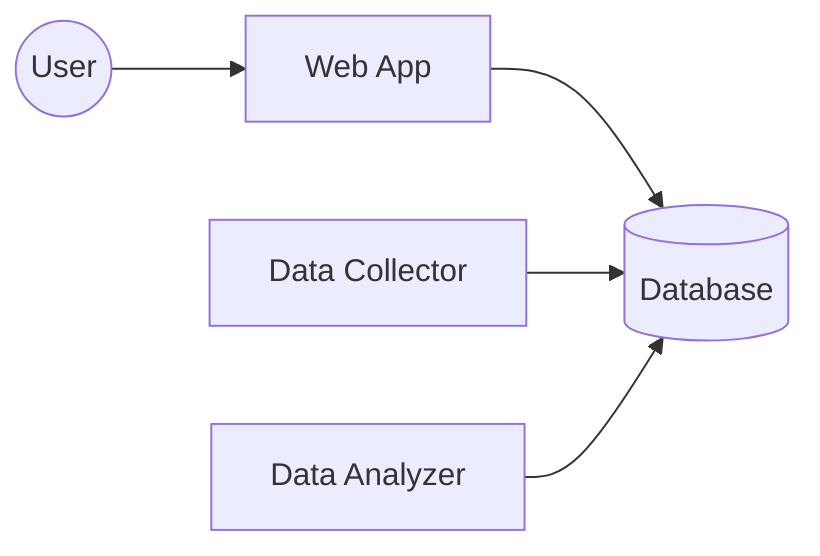
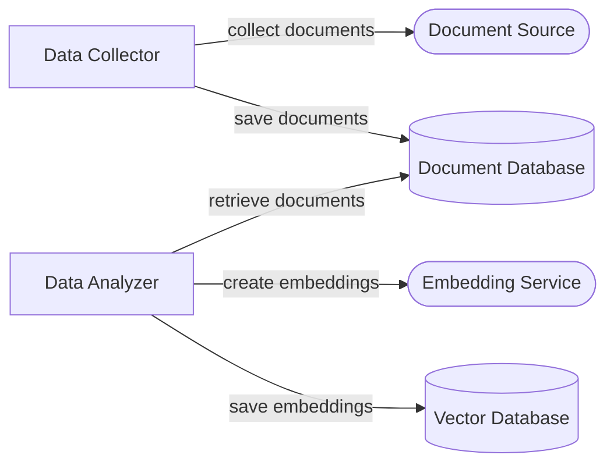
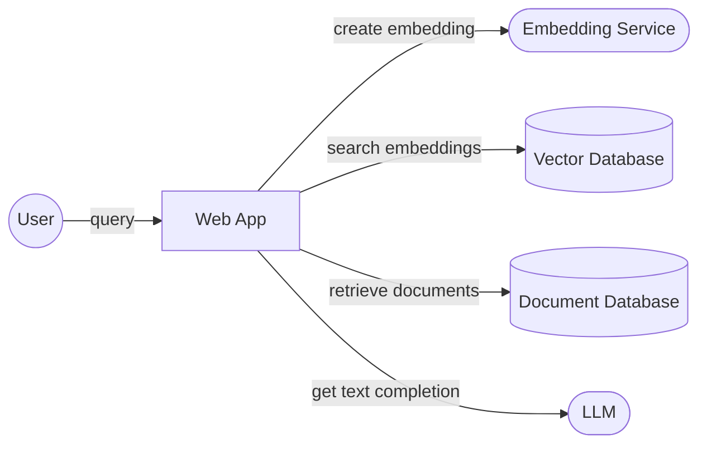

# News Analyzer

[Initial Capacity](https://initialcapacity.io) has worked on several production AI applications using LLMs.
We see a common pattern in these applications:
They need to collect and store lots of data from various sources, analyze this data with transformations and embeddings,
and display the results to users on the web.

## Data Collector Architecture

An architecture that we've been using for years is a great solution to this problem.
Internally we call this the Data Collector architecture.

The Data Collector architecture consists of three deployed applications talking to one or more databases.

1.  The web application displays data to the user and collects user input.
1.  The data collector is a background process that collects data from one or more sources and stores the data in a
    database.
1.  The data analyzer is another background process that reads the collected data, performs analysis, and stores the
    result in a database.

Allows the various parts of the system to change and scale at different paces. Decoupled yet cohesive.

## LLM Collection Architecture

A variation of the Data Collector architecture emerges in LLM applications

### Collection

1.  The data collector collects documents from one or more sources and stores the document text in a database.
1.  The data analyzer reads the collected data, creates embeddings, and stores these embeddings a vector database.

The web application collects user input, creates an embedding, searches the vector database for similar embeddings,
and provides the corresponding document text as context for an LLM text-completion query. 

## Sample application

The News Analyzer application is an implementation of the LLM Collection architecture.
It's built using Cloudflare's [Workers](https://developers.cloudflare.com/workers/), [Workers KV](https://developers.cloudflare.com/kv/),
[AI](https://developers.cloudflare.com/ai), and [Vectorize](https://developers.cloudflare.com/vectorize/), but the
architecture can be implemented in may different stacks (Google Cloud's [Cloud Run](https://cloud.google.com/run) and
[Cloud Functions](https://cloud.google.com/functions) with the [OpenAI API](https://platform.openai.com/docs/introduction),
and [Go](https://go.dev/) is another particularly well-suited stack).

